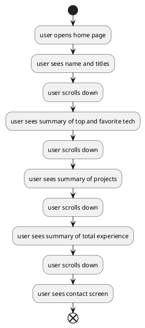

# Overview
When first entering the portfolio a user will likely want to get a general idea of what it is I do and who I am.
This means my name and titles should be front and center when opening the page.

A user will want to get to know more by seeing some of the technologies I enjoy using and the technologies that I have experience with.
Some of my most recent or best projects should also be displayed.

