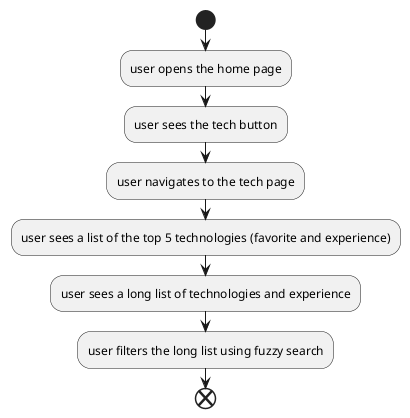

# Tech
A user will want to be able to see what technologies I use, and how much experience I have with them.
The technologies should be ordered by how much I want to use them, and how much experience I have with them.

# Flow

