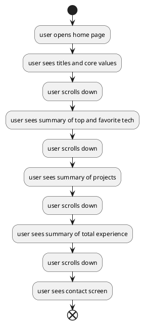

# Overview

When first entering the portfolio a user will likely want to get a general idea of what it is I do and who I am.
This means my name and titles should be front and center when opening the page.

A user will want to get to know more by seeing some of the technologies I enjoy using and the technologies that I have experience with.
Some of my most recent or best projects should also be displayed.

# Sections

## Learn

self teaching many languages, technologies and skills

## Practice

- Some big projects
  - Learning to use many technologies together
  - Kurabu
- many small projects
  - Learning specific technologies
- work experience

## Inspire

- Fancy feature friday talks
  - Docker
  - Kubernetes
  - XState
- Teacher
  - Active in typescript and turborepo community
  - Leading teams, helping team members
  - Mentoring fellow engineers

# Flow

# Real texts:

Learn; Practice; Inspire;

The software engineer with a passion for building and designing software, a dedication to helping developers learn, and a commitment to enhancing the developer experience.
