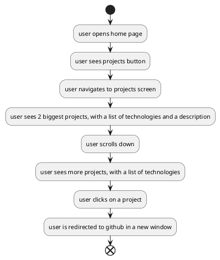

# Projects
When a user wants to get an in-depth look at my skills, and the software I build they should take a look at my projects. 
For this reason a page should be added where the user can find my projects and go to my github profile.

My best projects should be displayed at the start, and more clearly than the others.

# Flow

